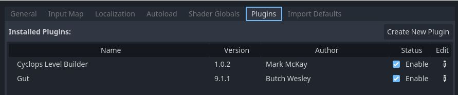

# Cyclops Level Builder

Cyclops Level Builder lets you quickly build environments in the Godot viewport.  Click and drag to create and edit blocks.  Use the material editor to assign materials.  All blocks have collision, so you will be able to interact with them right away.

## Installation

* [Download the latest release](https://github.com/blackears/cyclopsLevelBuilder/releases) from the releases page.  Unzip it into a temporary directory.
* Copy the /addons folder and everything in it into the root of the project you want to use Cyclops Level Builder in.
* Click on Project/Project Settings.  Select the Plugins tab and check Enable next to the Cyclops Level Builder entry.

## Usage

[Documentation for using Cyclops Level Builder is available here.](doc/index.md)

## Design

[An overview of the architecture of Cyclops Level Builder](doc/design.md) for those who want to dive into the code.

## Contributing 

Please open small issues.  PRs are welcome for small fixes.  Broader ideas can be opened for discussions in the [Discussions](https://github.com/blackears/cyclopsLevelBuilder/discussions) forum.

## Roadmap

[A list of things that I hope to have implemented in the future.](doc/roadmap.md)

## Support

If you found this software useful, please consider buying me a coffee on Kofi.  Every contribution helps me to make more software:

