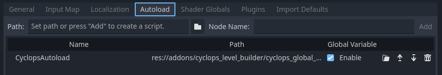

# Cyclops Level Builder

Cyclops Level Builder lets you quickly build environments in the Godot viewport.  Click and drag to create and edit blocks.  Use the material editor to assign materials.  All blocks have collision, so you will be able to interact with them right away.

Cyclops Level Builder 1.0.2 works with Godot version 4.2 and later.  Versions 1.0.1 and earlier will work with Godot 4.0.

## Installation

* [Download the latest release](https://github.com/blackears/cyclopsLevelBuilder/releases) from the releases page.  Unzip it into a temporary directory.
* Copy the /addons/cyclops_level_builder folder and everything in it into the root of the project you want to use Cyclops Level Builder in.
* Click on Project/Project Settings.  
    * Select the Autoload tab.  Select the folder icon next to the Path field and browse to the res://addons/cyclops_level_builder/cyclops_global_scene.tscn file.  Set the Node Name to CyclopsAutoload.  Then press Add to add it to the autoloads and make sure the Enable box is checked.  
    * Select the Plugins tab and check Enable next to the Cyclops Level Builder entry.

## Upgrading

It is strongly recommended that you make a backup of your project before you upgrade or change your version of Cyclops Level Builder.

You may notice a lot of errors being thrown when you first open your project after upgrading to a newer version of Cyclops.  This is due to a problem with the way the Godot editor keeps track of class names.  If a class is renamed or moved, Godot can become confused and no longer be able to find it which can cause a lot of error messages or even a crash.  Godot also saves this information, so the problem can persist even if you close and reopen Godot.  Fortunately, closing and reopening your project twice can usually cause Godot to rebuild its name cache.  If you notice error messages after changing to a different version of Cyclops, please close and reopen your project in the editor twice to allow Godot to recalculate its name index.

If you're upgrading your project from Cyclops v1.0.0, v1.0.1 or an earlier development version of v1.0.2, you will need to upgrade your CyclopsBlocks object.  To do this, simply select your CyclopsBlocks object in the Scene outliner and click the Upgrade button that appears in the toolbar.  This will create a new subtree in your scene where the CyclopsConvexBlock objects are replaced with the new CyclopsBlock object.  Your old CyclopsBlocks will still be there, but with its visibility turned off.  You can now delete the CyclopsBlocks object if you no longer require it.

## Usage

[Documentation for using Cyclops Level Builder is available here.](doc/index.md)

## Design

[An overview of the architecture of Cyclops Level Builder](doc/design.md) for those who want to dive into the code.

## Contributing 

Please open small issues.  PRs are welcome for small fixes.  Broader ideas can be opened for discussion in the [Discussions](https://github.com/blackears/cyclopsLevelBuilder/discussions) forum.

## Roadmap

[A list of things that I hope to have implemented in the future.](doc/roadmap.md)

## Support

If you found this software useful, please consider buying me a coffee on Kofi.  Every contribution helps me to make more software:

