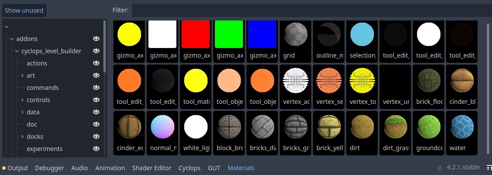
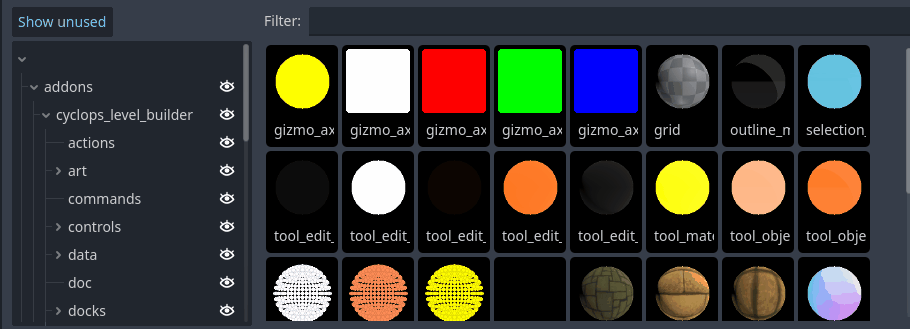
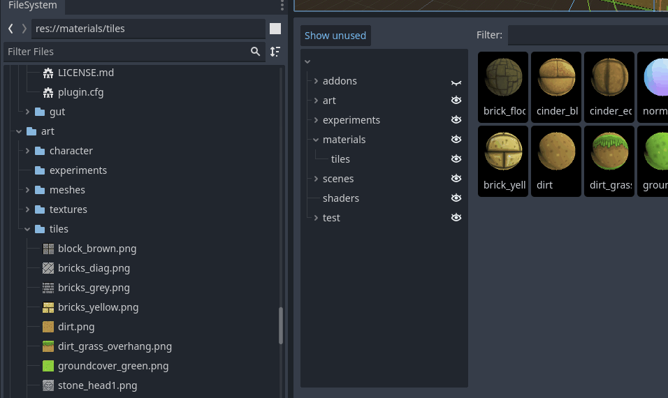

# Material Dock

The Material Dock provides an overview of all the materials in your project, and is the main way you will apply materials to your blocks.  Whenever you create or delete a material in your project, it will appear in the material window.

You can select a material in the material dock by clicking on it.  Your selection of a material in the dock is separate from selecting it in the FileSystem, so one selection will not affect the other.  Some Cyclops tools such as the Material Brush depend on which material is selected in the dock, so changing your selection will change how the tool works.

If you double click on a material swatch, the material will be applied to all selected blocks.

### Filtering material swatches

The left panel presents the directory structure of your project.  The eyeballs next to each directory name allow you to show and hide the materials present in any directory and any of its subdirectories.  
Pressing the `Show Unused` button will switch between showing all the directories in your project and only showing the ones that currently have materials in them.

The `Filter` text box will let you type in text to limit the materials shown by name.  Only materials with names containing the same text will be shown.

### Creating new materials

The Material Dock provides you with a quick way of creating new materials from textures.  If you select a texture in the FileSystem and drag and drop it into the directory panel of the Material Dock, you will be presented with a dialog that creates a new material based on the texture you dragged in.  The image can be anything that Godot recognizes as a Texture2D, so png, jpg and exr files should all work.

If you drag and drop multiple textures at once, an animation will be created from the sequence of images and used as the source of the material.

You will have a choice of creating a StandardMaterial3D or a ShaderMaterial.  If you create a StandardMaterial3D, the image you dragged in will become the material's albedo texture.  If you create a ShaderMaterial, you will need to pick the shader source file the material will be based on.  You will also need to pick which material slot the texture you dragged in will be attached to.

## Support

If you found this software useful, please consider buying me a coffee on Kofi.  Every contribution helps me to make more software:

