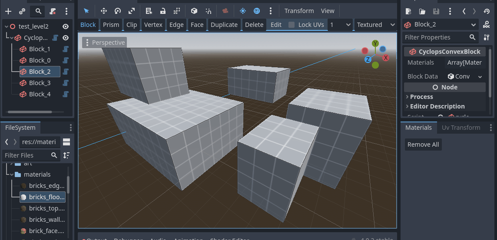

# Material Dock

The material dock provides a place to view and apply materials to your environment.

Add materials to the material dock by clicking and dragging them from the file system dock.

Apply a material to all selected blocks by double clicking on it in the material dock.

Apply a material to a specific face by switching the the Face tool, selecting the faces you want to set the material on, and then double licking the material you want in the Material Dock.

## Support

If you found this software useful, please consider buying me a coffee on Kofi.  Every contribution helps me to make more software:

