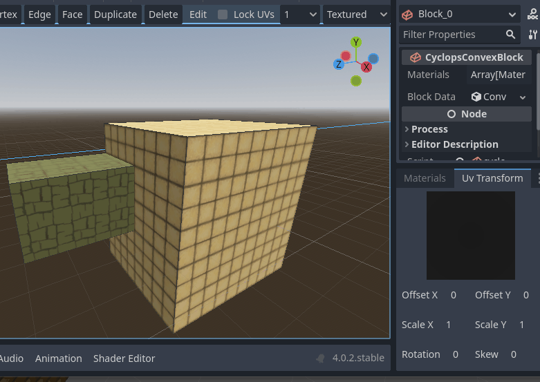

# Uv Transform Dock

The Uv Transform dock gives you finer control over the UV mapping of the faces of your blocks.  Cyclops Level Builder uses triplanar mapping to automatically generate the UVs of your mesh.  This means, for each face, the normal is used to determine which axis the face is most closely aligned to and then uses a planar projection along that axis to generate the UVs.  In addition to this, each face has a UV transform that will provide further adjustments to this mapping.  By manipulating this transform you can have your material slide, rotate and scale over the face of your block.

This dock gives you direct access to the uv transform of the face.  Make sure you've activated the Face tool and then select the face you want to adjust.  You can then click and drag on the Offset, Scale and Rotation inputs to adjust these parameters.  You can also click on them to enter values manually.  If more than one face is selected, the values of the active face of the active object will be shown in the editor.  If you make any changes to it, the new uv transform will be written to all the selected faces of the currently selected objects.  You can use this to quickly apply the same uv transform to many faces.

## Support

If you found this software useful, please consider buying me a coffee on Kofi.  Every contribution helps me to make more software:

