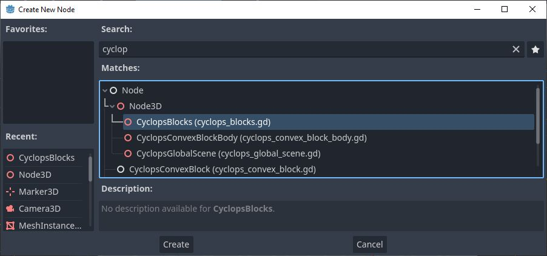
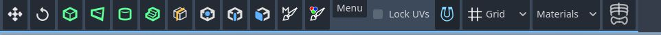
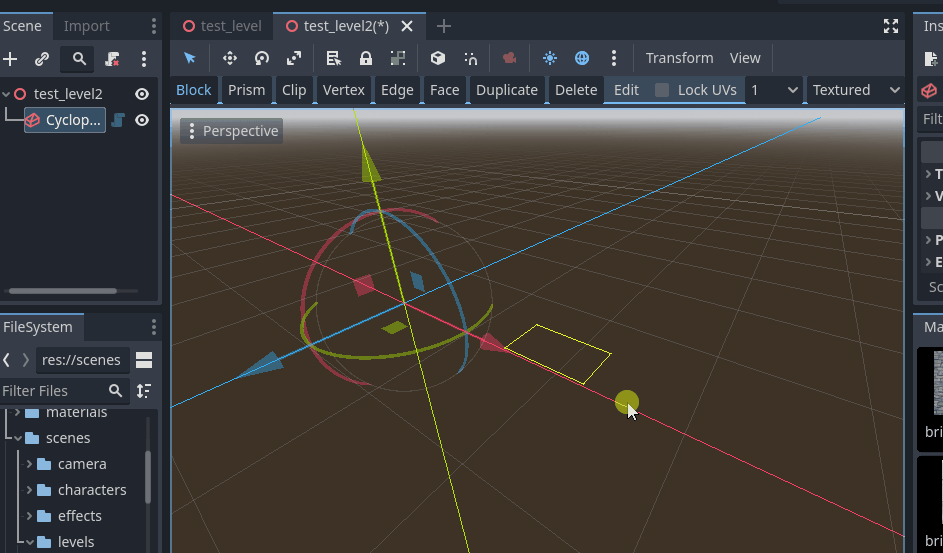
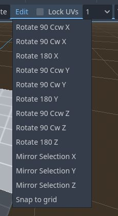

# Documentation

## Getting Started

### Create the CyclopsBlocks environment root

Before you do anything else, you will need to create a CyclopsBlocks node in your scene.

The CyclopsBlocks will be the root of the root of the environment you are creating.  You must select it to be able to add blocks to your scene or be able to use any of the block editing tools.

### Creating your first block

Click on the CyclopsBlocks node in your scene to show the Cyclops buttons in the editor toolbar.

Make sure the Block button is pressed, then click and drag in the viewport to start drawing your first block.  You will need to click and drag to create the base, then move the mouse to drag out the height and click again to finish drawing the cube.

### Design considerations

Cyclops LeveL Builder uses convex blocks to build scenes.  This is means that no block in your scene can have indentations or inside corners.  You can still create scenes that have holes, arches and other concave architecture, but you will need to build them out of convex pieces.  Using the Clip tool can be very helpful to carve holes and empty spaces into convex blocks.

This is in the tradition of level design techniques from early 3D games such as Quake.  The advantages of using convex blocks is that it keeps things clean and convex collision detection is very fast.  However, it is less expressive and I might change this to use a general mesh in future updates to this project. 

Cyclops Level Builder also uses a grid and most operations will automatically snap vertices to the grid.  This is because in level design, you usually want walls, floors and ceiling to join up and be flush with each other.  Many other modeling programs make this difficult to do.

Most commands are undoable, so you can use Ctrl-Z to undo most actions and Ctrl-Shift-Z to redo them.

Most of the tools support pressing the Escape key to cancel the current operation.

## Tools

There are several tools in the toolbar that let you create and edit blocks:

* [Block](tool_block.md)
* [Prism](tool_prism.md)
* [Cylinder](tool_cylinder.md)
* [Stairs](tool_stairs.md)
* [Clip](tool_clip.md)
* [Vertex](tool_vertex.md)
* [Edge](tool_edge.md)
* [Face](tool_face.md)
* [Duplicate](tool_duplicate.md)

## Other toolbar features

### Delete

Delete currently selected blocks.

* Pressing X in Block mode will also delete selected blocks.

### Menu

The menu has a number of useful commands.

* Duplicate Selected Blocks - Duplicates selected blocks.  Click with mouse to place duplication.
* Delete Selected Blocks - Delete all currently selected blocks.
* Snap to Grid - Snaps all vertices to the grid, just in case some are misaligned.

* Rotate 90 Ccw X - Rotate 90 degrees counter clockwise around the X axis
* Rotate 90 Cw X - Rotate 90 degrees clockwise around the X axis
* Rotate 180 X - Rotate 180 degrees around the X axis
* Mirror Selection X - Mirror the selection in the X axis

* Rotate 90 Ccw Y - Rotate 90 degrees counter clockwise around the Y axis
* Rotate 90 Cw Y - Rotate 90 degrees clockwise around the Y axis
* Rotate 180 Y - Rotate 180 degrees around the Y axis
* Mirror Selection Y - Mirror the selection in the Y axis

* Rotate 90 Ccw Z - Rotate 90 degrees counter clockwise around the Z axis
* Rotate 90 Cw Z - Rotate 90 degrees clockwise around the Z axis
* Rotate 180 Z - Rotate 180 degrees around the Z axis
* Mirror Selection Z - Mirror the selection in the Z axis

### Lock UVs

Cyclops Level Builder uses triplanar mapping to provide UVs to materials.  This means that if you move a block, the UVs will be updated to match where the block is in the world, which is generally what you want when building levels.  However, sometimes you want the texture to remain fixed when you move a block.  If Lock Uvs is checked, the UV layout will travel with the block instead of updating based on the world position of the block.

### Grid Snapping Size

Godot 4.0.2 does not provide addons with access to the 3D snapping, so Cyclops Level Builder implements its own snapping.  You can change the value of this dropdown to change the grid snapping size.

### Display Mode

The display mode lets you switch between drawing blocks with materials and drawing them as wireframe objects.

## General Commands

* Ctrl-D will activate the duplicate tool.  When you type this in Block mode, the current selection will be duplicated and will follow the mouse cursor.  Click to drop the duplicated blocks at your desired location.

* X key to delete all selected blocks.
    * I wanted to use the Delete key, but this was causing a conflict with Godot so I went with the X key instead.

## Docks

When the CyclopsBlocks object is selected, extra docked windows will appear to give you further editng options:

* [Material](dock_material.md)
* [UV Transform](dock_uv_transform.md)
* [Tool Properties](dock_tool_properties.md)

## Support

If you found this software useful, please consider buying me a coffee on Kofi.  Every contribution helps me to make more software:

