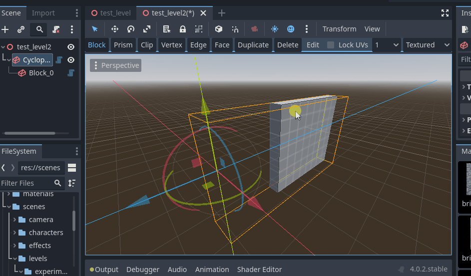
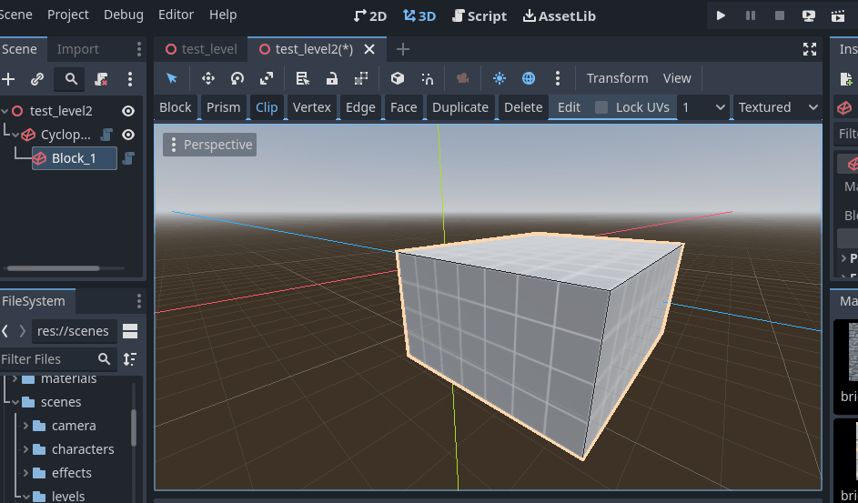

# Documentation

## Getting Started

### Create the CyclopsBlocks environment root

Before you do anything else, you will need to create a CyclopsBlocks node in your scene.

The CyclopsBlocks will be the root of the root of the environment you are creating.  You must select it to be able to add blocks to your scene or be able to use any of the block editing tools.

### Creating your first block

Click on the CyclopsBlocks node in your scene to show the Cyclops buttons in the editor toolbar.

Make sure the Block button is pressed, then click and drag in the viewport to start drawing your first block.  You will need to click and drag to create the base, then move the mouse to drag out the height and click again to finish drawing the cube.

### Design considerations

Cyclops LeveL Builder uses convex blocks to build scenes.  This is means that no block in your scene can have indentations or inside corners.  You can still create scenes that have holes, arches and other concave architecture, but you will need to build them out of convex pieces.  Using the Clip tool can be very helpful to carve holes and empty spaces into convex blocks.

This is in the tradition of level design techniques from early 3D games such as Quake.  The advantages of using convex blocks is that it keeps things clean and convex collision detection is very fast.  However, it is less expressive and I might change this to use a general mesh in future updates to this project. 

Cyclops Level Builder also uses a grid and most operations will automatically snap vertices to the grid.  This is because in level design, you usually want walls, floors and ceiling to join up and be flush with each other.  Many other modeling programs make this difficult to do.

Most commands are undoable, so you can use Ctrl-Z to undo most actions and Ctrl-Shift-Z to redo them.

Most of the tools support pressing the Escape key to cancel the current operation.

## Tools

There are several tools in the toolbar that let you create and edit blocks.

### Block

This is your main tool for creating new blocks.  It also lets you select and move blocks.

* Click and drag in an empty space or an unselected block to draw the base of a new block.  When you release the mouse button, you will switch to dragging out the height of the block.  Release the mouse button a second time to finish drawing the block.
    * If you click on the side of an unselected block, the block you are draing will automatically follow the surface of the existing cube.

* Click on a block to select it.  You can change how the selection works by holding the Ctrl and Shift keys.
    * None - Replace the current selection
    * Shift - Toggle the selection.  Unselected things will become selected and visa versa.
    * Ctrl - Add the clicked block to the current selection
    * Ctrl + Shift - Remove the block from the current selection
* Click and drag on a selected block to move all selected blocks.  The modifier keys will affect how the blocks move.
    * None - Blocks will move in the XZ plane
    * Alt - Blocks will be moved along the Y axis

* If you hold Ctrl while clicking and dragging on the face of a block, the block will be extruded along that face.

### Prism

The prism tool lets you place multiple points for your base before dragging out the length of your block.

* Click in empty space or on the surface of a block to begin placing points for the base of your block.
     * Keep clicking to place more points for the base
     * To remove the last point you added, press the Backspace key
     * To cancel building the block, press the Escape key
     * When you're finished building your base, press Enter to switch to dragging the height of the block.

### Clip

The clip tool lets you cut blocks along a cutting plane.

* Start by selecting the blocks you want to cut in Block mode and then switch to using the Clip tool.
* Click on the block you want to cut in two different places to define the line you want to cut along.
    * You can optionally also click to add a third point.  If only two points are placed, the cutting plane will be perpendicular to the face the cutting line lies along.  Otherwise all three placed points will define the cutting plane.
    * Press Backspace to remove the last placed clipping point.
    * Press Enter to commit the cutting operation.
    * Press Escape to cancel clipping.

### Vertex

Edit the vertices of the block.

* Select blocks in Block mode that you want to edit the vertices of, and then switch to the Vertex tool.
* Click on a vertex to select it.
    * You can use the modifier keys to affect how the vertex is added to or removed from the selection.
    * Selected vertices will be displayed in orange.  One vertex may be white which means it is the active vertex, which gives it priority by some commands.
* Click and drag on a vertex to move it.  If you drag a selected vertex, all selected vertices are moved.
    * Vertex will be moved in the XZ plane.  Hold Alt to switch to moving along the Y axis.
* Hover the mouse cursor over another block and press Alt-Q to switch to editing the vertices of that block.

### Edge

Edit the edges of the block.

* Select blocks in Block mode that you want to edit the edges of, and then switch to the Edge tool.
* Click on an edge to select it.
    * You can use the modifier keys to affect how the edge is added to or removed from the selection.
    * Selected edges will be displayed in orange.  One edge may be white which means it is the active edge, which gives it priority by some commands.
* Click and drag on an edge to move it.  If you drag a selected edge, all selected edges are moved.
    * Edge will be moved in the XZ plane.  Hold Alt to switch to moving along the Y axis.
* Hover the mouse cursor over another block and press Alt-Q to switch to editing the edges of that block.

### Face

Edit the faces of the block.

* Select blocks in Block mode that you want to edit the faces of, and then switch to the Face tool.
* Click on a face to select it.
    * You can use the modifier keys to affect how the face is added to or removed from the selection.
    * Selected faces will be displayed in orange.  One face may be white which means it is the active face, which gives it priority by some commands.
* Click and drag on a face to move it.  If you drag a selected face, all selected faces are moved.
    * Face will be moved in the XZ plane.  Hold Alt to switch to moving along the Y axis.
* Hover the mouse cursor over another block and press Alt-Q to switch to editing the faces of that block.

### Duplicate

The duplicate tool will duplicate the current selection.

* A duplicate of all the currently selected objects will begin to follow your mouse cursor.  Click to place them in the scene.
* You can also press Ctrl-D in Block mode to activate this tool.

## Other toolbar features

### Delete

Delete currently selected blocks.

* Pressing X in Block mode will also delete selected blocks.

### Edit Menu

The edit menu has a number of useful commands.

* Rotate 90 Ccw X - Rotate 90 degrees counter clockwise around the X axis
* Rotate 90 Cw X - Rotate 90 degrees clockwise around the X axis
* Rotate 180 X - Rotate 180 degrees around the X axis
* Rotate 90 Ccw Y - Rotate 90 degrees counter clockwise around the Y axis
* Rotate 90 Cw Y - Rotate 90 degrees clockwise around the Y axis
* Rotate 180 Y - Rotate 180 degrees around the Y axis
* Rotate 90 Ccw Z - Rotate 90 degrees counter clockwise around the Z axis
* Rotate 90 Cw Z - Rotate 90 degrees clockwise around the Z axis
* Rotate 180 Z - Rotate 180 degrees around the Z axis
* Mirror Selection X - Mirror the selection in the X axis
* Mirror Selection Y - Mirror the selection in the Y axis
* Mirror Selection Z - Mirror the selection in the Z axis
* Snap to Grid - Snaps all vertices to the grid, just in case some are misaligned.

### Lock UVs

Cyclops Level Builder uses triplanar mapping to provide UVs to materials.  This means that if you move a block, the UVs will be updated to match where the block is in the world, which is generally what you want when building levels.  However, sometimes you want the texture to remain fixed when you move a block.  If Lock Uvs is checked, the UV layout will travel with the block instead of updating based on the world position of the block.

### Grid Snapping Size

Godot 4.0.2 does not provide addons with access to the 3D snapping, so Cyclops Level Builder implements its own snapping.  You can change the value of this dropdown to change the grid snapping size.

### Display Mode

The display mode lets you switch between drawing blocks with materials and drawing them as wireframe objects.

## General Commands

* Ctrl-D will activate the duplicate tool.  When you type this in Block mode, the current selection will be duplicated and will follow the mouse cursor.  Click to drop the duplicated blocks at your desired location.

* X key to delete all selected blocks.
    * I wanted to use the Delete key, but this was causing a conflict with Godot so I went with the X key instead.

## Material Dock

The material dock provides a place to view and apply materials to your environment.

Add materials to the material dock by clicking and dragging them from the file system dock.

Apply a material to all selected blocks by double clicking on it in the material dock.

Apply a material to a specific face by switching the the Face tool, selecting the faces you want to set the material on, and then double licking the material you want in the Material Dock.

## Uv Transform Dock

The Uv Transform dock gives you finer control over the UV mapping of the faces of your blocks.  Cyclops Level Builder uses triplanar mapping to automatically generate the UVs of your mesh.  This means, for each face, the normal is used to determine which axis the face is most closely aligned to and then uses a planar projection along that axis to generate the UVs.  In addition to this, each face has a UV transform that will provide further adjustments to this mapping.  By manipulating this transform you can have your material slide, rotate and scale over the face of your block.

This dock gives you direct access to the uv transform of the face.  Make sure you've activated the Face tool and then select the face you want to adjust.  You can then click and drag on the Offset, Scale and Rotation inputs to adjust these parameters.  You can also click on them to enter values manually.  If more than one face is selected, the values of the active face of the active object will be shown in the editor.  If you make any changes to it, the new uv transform will be written to all the selected faces of the currently selected objects.  You can use this to quickly apply the same uv transform to many faces.

## Support

If you found this software useful, please consider buying me a coffee on Kofi.  Every contribution helps me to make more software:

