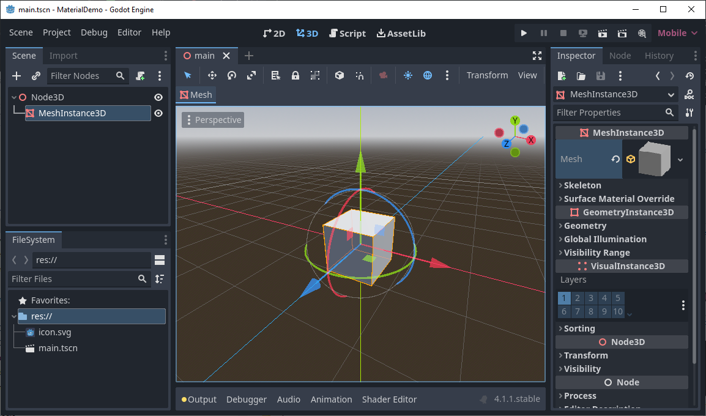
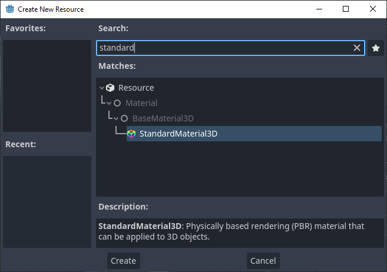
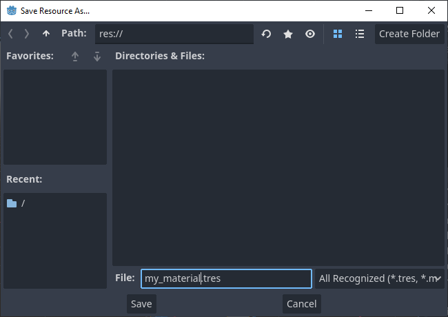
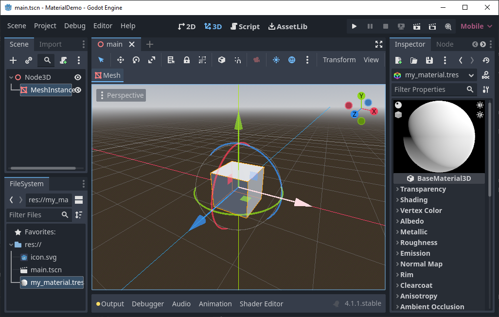
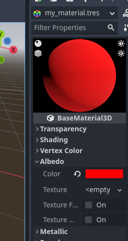
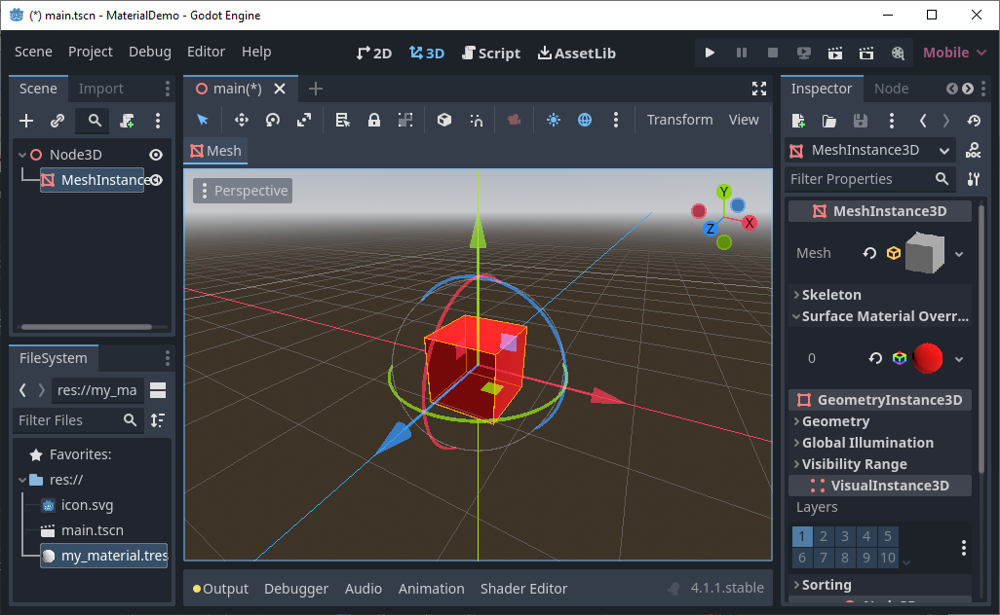
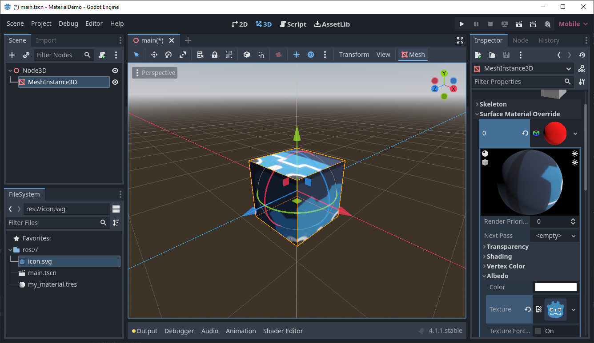

# Getting started with Materials

## What is a Material?

Godot has a wide variety of materials that effect how your 3D geometry is displayed.  Shaders can be simple and just draw your geometry with a solid color.  They can also let you wrap an image texture over your object like wallpaper.  Shaders can add lighting effects to make your object glow or be see-through like glass.  Shaders can even change the shape of your geometry and make it animate with time.  Once you start getting into shaders, you'll find they can have a huge impace on how your scene looks.

In Godot, all shaders extend the Material base class.  The StandardShader3D handles most typical use cases and is a good place to start.  It is highly configurable and has a lot of parameters, so it may be a bit overwhelming at first.  Start by setting the Albedo to the color that you want your mesh to be.  You can then explore all the other options to change how your mesh can glow, shine like metal, become see through and do other things.  [The Godot website has a page describing all the properties of this versitile shader.](https://docs.godotengine.org/en/stable/tutorials/3d/standard_material_3d.html)

Godot provides more complex shaders too.  If the StandardShader3D doesn't provide the effect you need, you can write your own shader using Godot's own shader langage.  This is a separate programming language Godot provides just for shaders.  It can be tricky to program your own shader, but sometimes it's the best route to take if you need your shader to do something very specific.  Godot also provides VisualShaders which are similar to shader programs, but allow you to build your shader by joining nodes together instead of writing a program, which you may find easier to do.  [Godot has a great webpage describing how to get started writing your own custom shader](https://docs.godotengine.org/en/stable/tutorials/shaders/your_first_shader/index.html)

## Creating a basic StandardShader3D

First, let's create a scene that we can use to display our material.  Create a new scene and save it as main.tscn.  Then add a MeshInstance3D as a child of the root node.  Click on the MeshInsance3D node so that its properties appear in the Inspector panel.  Finally, click on the Mesh property in the Inspector tab and select New BoxMesh from the dropdown menu.

Now let's create a new StandardMaterial3D.  Right click on the root of the FileSystem and select Create New/Resource.  Type the word 'standard' into the search bar and then double click StandardMaterial3D in the Matches window.

Save your new material as my_material.tres.

A new material has been created and is stored in your filesystem.  Double click on it to show its porperties in the Inspector tab.

We can now edit the properties of the StandardMaterial3D.  Click on the Albedo drop down in the inspector panel.  Next, click on the Color property.  A color picker will pop up allowing you to choose a color.  You can choose whatever color you like.  I'll pick red for this demonstration.  You can also play around with changing other properties to see how they affect your material.

Now let's apply this material to the mesh we created back in the first step.  Click on the MeshInstance3D in the Scene panel to show it's properties in the Inspector panel.  Then in the Inspector panel, click on the Surface Material Override drop down to open it.  Finally, drag and drop the my_material.tres file we created into the first slot in the Surface Material Override menu.

You material is now applied to your mesh object.  If you click on your material resource object again, you can continue to change its properties and see the effects on the mesh as you do so.

Let's add a texture to our shader.  Click on the material in the Surface Material Override to expand it.  Now change the Albedo color back to white.  Finally, let's drag the icon.svg texture from the FileSystem into the Albedo/Texture slot.  Now our material is drawing the texture on the object.

## Creating materials for Cyclops Level Builder

You can create materials for Cyclops Level Builder in the same way you create materials for any other object in Godot.  One thing to keep in mind is that Cyclops will automatically generate UV coordinates based on the world position of the block vertices.  You may need to adjust the UV1 scale and offset to get your textures to render at your desired size.

