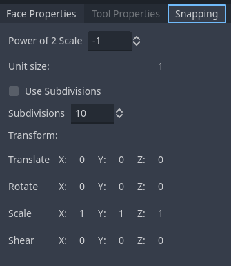

# Snapping

When the magnet button is pressed, snapping is enabled.  The dropdown allows you to switch between snapping modes.

There is a dock window in the lower right hand corner that contains snapping options.  You may adjust properties of the currently selected snapping tool here.

Not all tools and commands use snapping.  Please check the tool to see if it has any special rules concerning snapping.

## Magnet button

When pressed, snapping is enabled.

## Grid

* Power of 2 Scale - Scales the snapping grid by 2 to the power of this value.  Basically, divides the grid size by 2 whenever you subtract 1 and multiplies it by 2 whenever you add 1.
* Unit Size - Size of a basic unit.  Set to 1 to match Godot's default unit size.  The basic unit typically represents 1 meter, but you can adjust your Godot project settings to have it represent something else.
* Use Subdivisions - If enabled, the grid will be further subdivided by the Subdivisions amount.
* Subdivisions - Allows the basic unit to be subdivided into smaller units.  This way if your basic unit is a meter, you can set this to 10 to subdivide it into decimeters.  Or if you're measuring in yards, you can set this to 3 to subdivide it into feet.
* Transform - Apply an arbitrary transform to the grid.  The motivation here is to let the user slant the grid so the grid can be used for triangular or hexagonal layouts, but you can also use it to fine tune your snapping.

## Vertex

Active tool will snap to the closest vertex provided there is a vertex nearby to snap to.

## Support

If you found this software useful, please consider buying me a coffee on Kofi.  Every contribution helps me to make more software:

