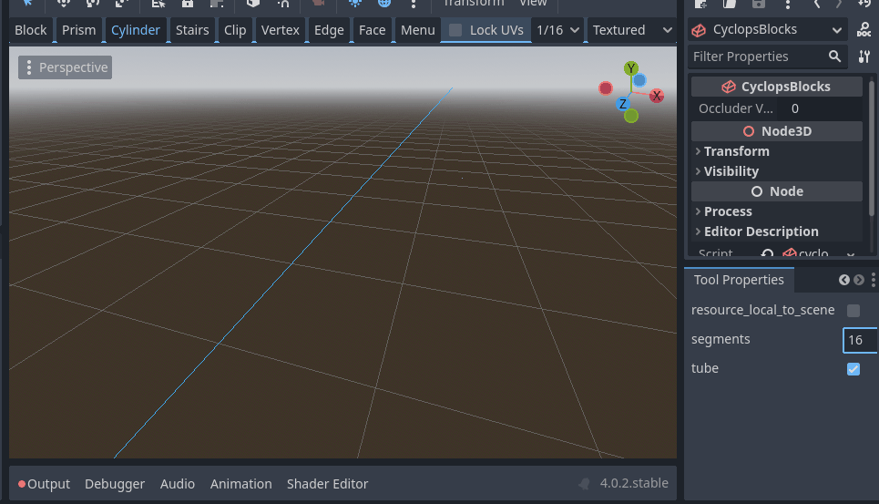

# Cylinder Tool

The cylinder tool lets you draw cylinders and tubes.
Checking the `tube` option in the tool properties dock will enable drawing tubes, which are hollow cylinders.

* Click in empty space or on the surface of a block to place the center of your cylinder or tube.
     * Drag the mouse and release the button to make the base of your cylinder
     * If you are drawing a tube, you with then need to click and drag again to define the second ring.
     * Drag the mouse along the central axis to define the height of the cylinder.  You can use the mouse wheel to change the number of sides the cylinder has.
     * To cancel building the block, press the Escape key.  You can also right click with the mouse.

## Support

If you found this software useful, please consider buying me a coffee on Kofi.  Every contribution helps me to make more software:

