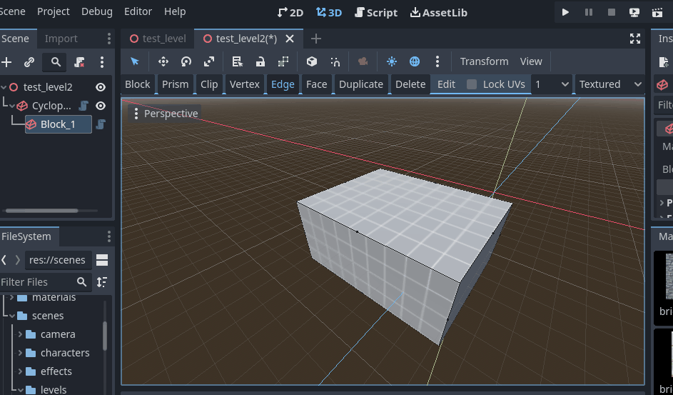

# Edge Tool

Edit the edges of the block.

* Select blocks in Block mode that you want to edit the edges of, and then switch to the Edge tool.
* Click on an edge to select it.
    * You can use the modifier keys to affect how the edge is added to or removed from the selection.
    * Selected edges will be displayed in orange.  One edge may be white which means it is the active edge, which gives it priority by some commands.
* Click and drag on an edge to move it.  If you drag a selected edge, all selected edges are moved.
    * Edge will be moved in the XZ plane.  Hold Alt to switch to moving along the Y axis.
* Hover the mouse cursor over another block and press Alt-Q to switch to editing the edges of that block.

## Support

If you found this software useful, please consider buying me a coffee on Kofi.  Every contribution helps me to make more software:

