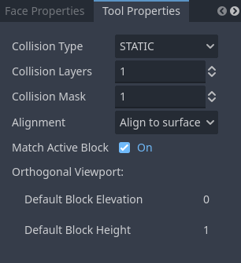

# Block Tool

This is your main tool for creating new blocks.  It also lets you select and move blocks.

* Click and drag in an empty space or an unselected block to draw the base of a new block.  
    * When you release the mouse button, you will switch to dragging out the height of the block.  
    * Release the mouse button a second time to finish drawing the block.
    * Press Escape to cancel drawing the block.  Right clicking will also cancel drawing the block.

### Tool Properties

* Collision Type - Type of collision shape that will be created for this block when it is exported
* Collision Layers - Collision layer flags for created block
* Collision Mask - Collision mask flags for created block
* Alignment
    * Align to surface - The base of the block you're creating will lie along the surface of the nearest surface under the cursor
    * XY Plane - The base of the block will lie on the XY plane
    * XZ Plane - The base of the block will lie on the XZ plane
    * YZ Plane - The base of the block will lie on the YZ plane

* Match active block - Elevation and height properties of the block you are drawing will be copied from the current active block.  This will be in effect if you start drawing the block when the mouse is over an empty space or if `Alignment` has been set to something other than `Align to surface`.
* Orthogonal Viewport - These properties affect properties of the shape you create when you are drawing in an orthogonal viewport and you are not using the active block to define these properties
    * Default Block Elevation - Default elevation of block.
    * Default Block Height - Default height of block.

## Support

If you found this software useful, please consider buying me a coffee on Kofi.  Every contribution helps me to make more software:

