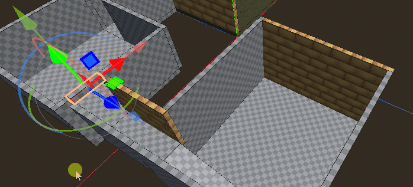
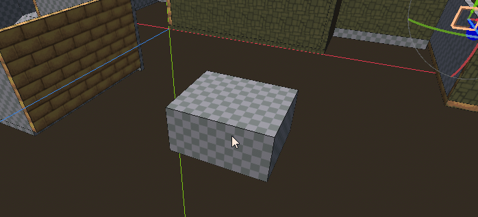

# Move Tool

Select and move blocks in your scene.

## Drag selection rectangle

Left click and drag with the mouse to select blocks within the rectangle's area.

* Drag - Blocks within the rectangle become the new selection.
* Shift-Drag - Toggle selection state of blocks.
* Ctrl-Drag - Add blocks to selection.
* Ctrl-Shift-Drag - Remove blocks from selection.

## Move gizmo

When one or more blocks is selected, a movement gizmo will be drawn onscreen.  You may click and drag on the arrows to move the block along a particular axis.  Click and drag on one of the square patches to move the object in the plane perpendicular to the arrow of the same color.

Right click in the middle of an operation to cancel it.

At the moment, this gizmo overlaps Godot's default editor movement gizmo.  There is no way to turn Godot's gizmo off, but it also does not affect the movement, so you can just ignore it.

### Tool Properties

* Transform Space - Coordinate space to move block in
* Triplanar Lock UVs - Use triplanar mapping to update UVs when block is moved.

## Key Presses

* Escape - Cancel the current movement operation.
* G - Start moving objects in the plane perpendicular to the viewer.  Works similar to how the G key works in Blender.
* X - Restrict movement to the X axis when moving with the G key.  Shift-X to move perpendicular to the X axis
* Y - Restrict movement to the Y axis when moving with the G key.  Shift-Y to move perpendicular to the Y axis
* Z - Restrict movement to the Z axis when moving with the G key.  Shift-Z to move perpendicular to the Z axis
* Alt-Q - Switch selection to the block under the cursor.

## Support

If you found this software useful, please consider buying me a coffee on Kofi.  Every contribution helps me to make more software:

